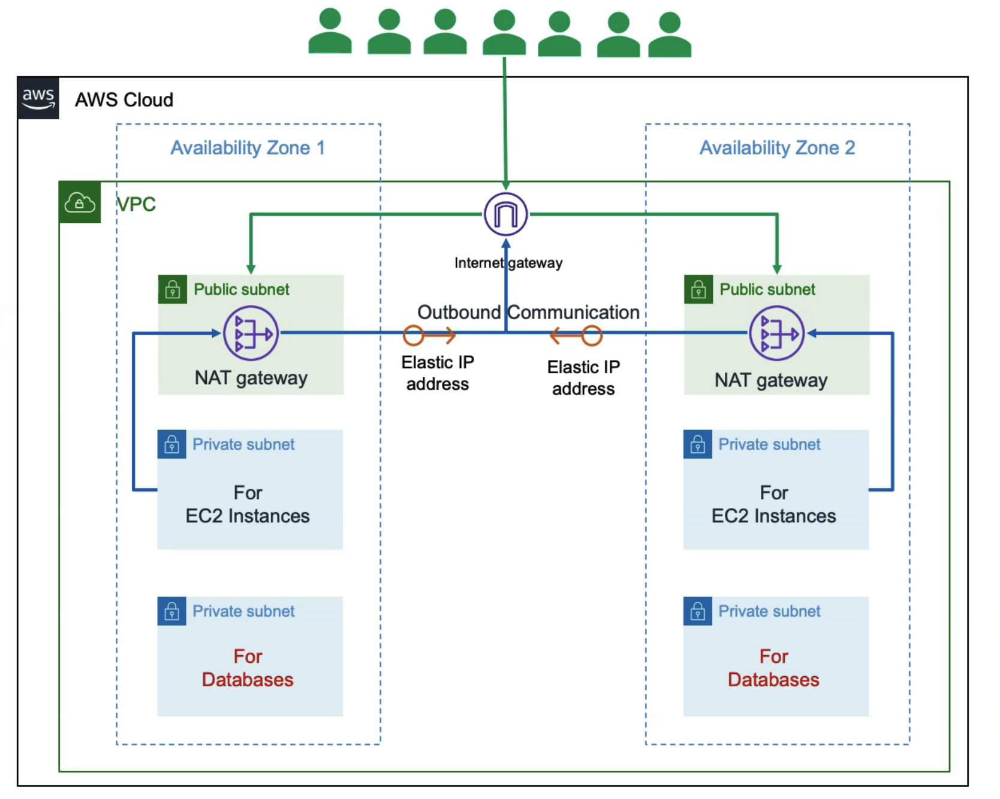

build three tier vpc in aws with web, app and db. will create it using the VPC, internet gateway, nat gateway, elastic IP address, route table, public subnets, private subnets.

manual build - will help to know what we are exactly doing.

